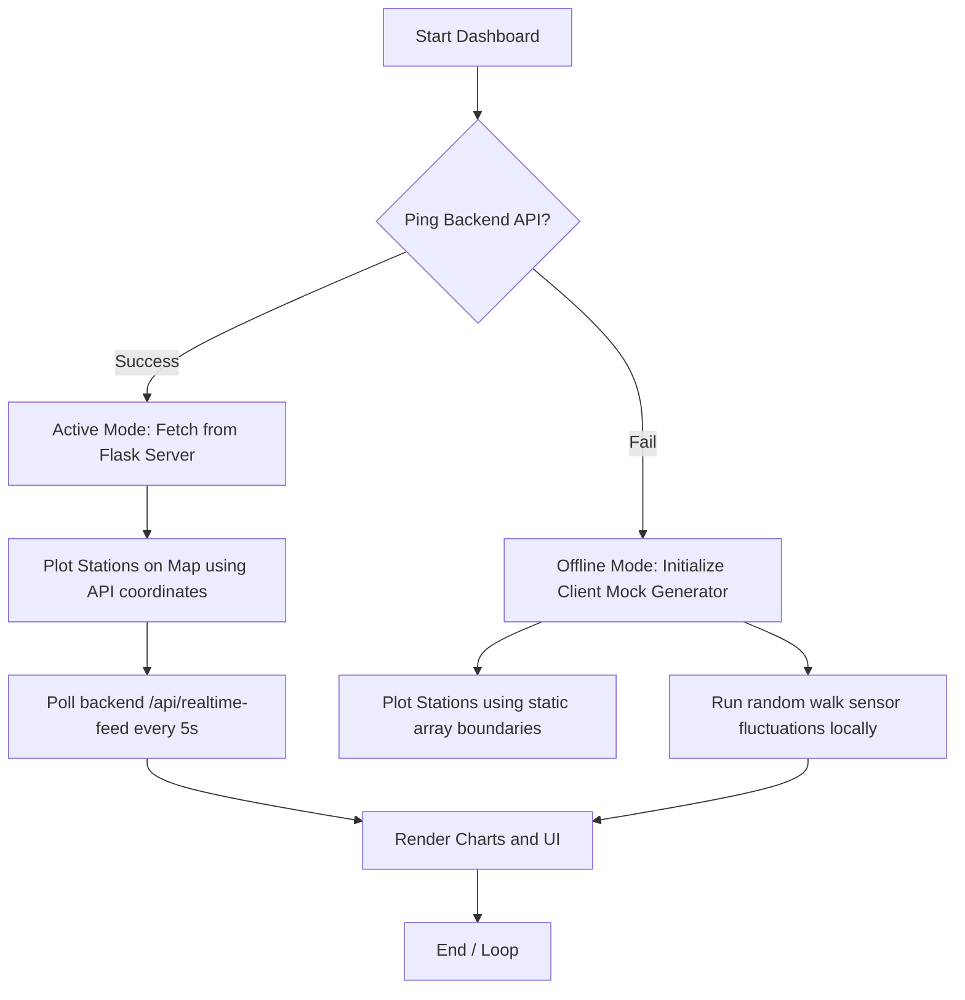

# “AI-Driven Unified Data Platform for Marine Biodiversity”

A Minor Project Report submitted to the
**RAJIV GANDHI PROUDYOGIKI VISHWAVIDYALAYA, BHOPAL**

in partial fulfillment of the requirements for the award of the degree of
**B.TECH**
**IN**
**CSE-DATA SCIENCE**

**Submitted by:**
- Kushagra Sharma (0105CD231120)
- Muskan Daheriya (0105CD231130)
- Nainshi Rahangdale (0105CD231133)
- Krishna Gupta (0105CD231115)

**Under the Guidance of:**
**Prof. Chitra Mathankar**

---

### DEPARTMENT OF CSE-DATA SCIENCE
### ORIENTAL INSTITUTE OF SCIENCE & TECHNOLOGY
**BHOPAL (M.P.)-462021, INDIA**
**Aug-Dec (2025-26)**

---
\pagebreak

## ORIENTAL INSTITUTE OF SCIENCE & TECHNOLOGY
**Bhopal (M.P.)-462021, India**
*Approved by AICTE, New Delhi & Govt. of M.P. Affiliated to Rajiv Gandhi Proudyogiki Vishwavidyalaya, Bhopal*

### DEPARTMENT OF CSE-DATA SCIENCE

### BONAFIDE CERTIFICATE

This is to certify that Mr. Kushagra Sharma, Ms. Muskan Daheriya, Ms. Nainshi Rahangdale, and Mr. Krishna Gupta of B.Tech. CSE-Data Science Department, Enrolment Nos. 0105CD231120, 0105CD231130, 0105CD231133, and 0105CD231115, have successfully submitted their Minor Project Report on **"AI-Driven Unified Data Platform for Marine Biodiversity"** during the academic year 2025-2026 as partial fulfillment of the Bachelor of Technology in CSE (Data Science).

<br><br>
Date: _________
Place: _________

<br><br>
**Prof. Chitra Mathankar**  
*Name of Guide*  

**Dr. Swati Pandey**  
*Name of HOD*  

---
\pagebreak

## ACKNOWLEDGEMENT

We wish to express our profound gratitude to **Prof. Chitra Mathankar**, Department of CSE-Data Science, Oriental Institute of Science and Technology, Bhopal, for her invaluable guidance, sustained help, and inspiration in carrying out the work.

We sincerely thank **Dr. Swati Pandey**, Head of CSE-Data Science Department, OIST Bhopal, for her cooperation and guidance during the project work.

I am thankful to all the faculty members and other non-teaching staff of the CSE (Data Science) Department for their cooperation.

We wish to express our deep gratitude to **Dr. R.K. Shukla**, Director, OIST Bhopal, for his kind permission to carry out the work at OIST Bhopal.

Finally, we would like to thank all the faculty members and other persons who directly or indirectly helped us in carrying out this project work.

<br><br>
**NAME OF STUDENTS:**
- Kushagra Sharma (0105CD231120)
- Muskan Daheriya (0105CD231130)
- Nainshi Rahangdale (0105CD231133)
- Krishna Gupta (0105CD231115)

---
\pagebreak

## ABSTRACT

The rapid degradation of marine habitats due to climate change, ocean acidification, and commercial overexploitation highlights the urgent need for integrated, real-time ecosystem monitoring. Traditional marine databases are often decoupled, static, and lack analytical depth. To address these limitations, this project presents the **AI-Driven Unified Data Platform for Marine Biodiversity**, a comprehensive client-server application that unifies chemical, physical, and molecular biological datasets into a single dashboard.

The backend of the platform is built in Python using Flask, structured around three analytical engines:
1. **Oceanographic Analyzer**: Uses an `IsolationForest` machine learning model to run multi-variable anomaly detection across named sensors, mapping parameters like pH drift, salinity shifts, and oxygen depletion.
2. **Fisheries Analyzer**: Simulates biomass index trends ($B/B_{MSY}$) and fishing mortality index ratios ($F/F_{MSY}$) to compute stock sustainability (Sustainable, At Risk, and Overfished) for key species.
3. **Molecular Biodiversity Analyzer**: Calculates ecological diversity indices, including the Shannon-Weiner index ($H'$), Simpson's index ($1-D$), Pielou's Evenness ($J'$), Margalef's Richness ($d$), and Berger-Parker Dominance ($d_{BP}$) from environmental DNA (eDNA) taxonomy matrices.

The frontend is a premium dark-mode web application implementing glassmorphism aesthetics. It integrates a **Leaflet-based interactive map** of ocean basins, dynamic **Chart.js** historical line plots, a **Species Database Explorer** with search and filter capabilities, and a **real-time Activity Log Feed** that polls live sensory drift alerts from a background server thread. Additionally, the dashboard incorporates an **offline simulation fallback mode** inside the client-side JavaScript, enabling the platform to run fully animated simulations in static web environments (like GitHub Pages) when the Flask API server is offline. This unified data platform bridges the gap between complex data science models and environmental policy, offering conservationists a powerful tool for maritime stewardship.

---
\pagebreak

## TABLE OF CONTENTS

- **01 INTRODUCTION**
  - 1.1 Objective
  - 1.2 Scope
  - 1.3 Problem Identification
- **02 BACKGROUND AND LITERATURE SURVEY**
  - 2.1 Existing Systems
  - 2.2 Innovativeness and Usefulness
  - 2.3 Modification and Improvement over Existing Implementations
- **03 PROCESS MODEL**
  - 3.1 Software Process Model Used
  - 3.2 Proposed Project Model
  - 3.3 Market Potential and Competitive Advantage
  - 3.4 Project Estimation
- **04 DESIGN**
  - 4.1 Data Flow Diagrams (DFD)
  - 4.2 Entity Relationship Diagram (ERD)
  - 4.3 Flowchart
  - 4.4 Use-Case Diagrams
  - 4.5 Sequence Diagram
  - 4.6 Activity Diagram
  - 4.7 Class Diagram
  - 4.8 Algorithm
- **05 TECHNOLOGY AND TOOLS USED**
  - 5.1 Programmatic Languages (HTML, CSS, JS, Python)
  - 5.2 Scientific and Data Science Frameworks
  - 5.3 Web Server Framework (Flask)
  - 5.4 Leaflet and Geospatial Rendering
- **06 HARDWARE REQUIREMENTS**
  - 6.1 Recommended Systems Configuration
- **07 CODING**
  - 7.1 Backend Python Code Highlights
  - 7.2 Frontend Web Code Highlights
- **08 SCREEN LAYOUTS**
- **09 FUTURE ENHANCEMENTS**
- **10 REFERENCES**

---
\pagebreak

## LIST OF FIGURES

| Figure No. | Title | Page No. |
| :--- | :--- | :--- |
| 4.1 | DFD Level 0 (Context Diagram) | 12 |
| 4.2 | DFD Level 1 (Data Flow Diagram) | 13 |
| 4.3 | Entity Relationship Diagram (ERD) | 15 |
| 4.4 | Step-by-Step Flowchart | 17 |
| 4.5 | Sequence Diagram | 18 |
| 4.6 | Activity Diagram | 19 |
| 4.7 | Class Diagram | 21 |

---
\pagebreak

## LIST OF ABBREVIATIONS

| Abbreviation | Full Form |
| :--- | :--- |
| **AI** | Artificial Intelligence |
| **eDNA** | Environmental DNA |
| **CPUE** | Catch Per Unit Effort |
| **DFD** | Data Flow Diagram |
| **ERD** | Entity Relationship Diagram |
| **MSY** | Maximum Sustainable Yield |
| **API** | Application Programming Interface |
| **JSON** | JavaScript Object Notation |
| **DO** | Dissolved Oxygen |
| **IDE** | Integrated Development Environment |
| **OS** | Operating System |
| **CORS** | Cross-Origin Resource Sharing |
| **HTML** | HyperText Markup Language |
| **CSS** | Cascading Style Sheets |

---
\pagebreak

## CHAPTER 1: INTRODUCTION

### 1.1 Objective
The primary objective of the **AI-Driven Unified Data Platform for Marine Biodiversity** is to create a digital workspace that aggregates physical oceanography, commercial fisheries management, and eDNA biodiversity indexes under a unified, real-time interface. Specific objectives include:
1. **Automated Anomaly Detection**: Utilizing unsupervised machine learning (Isolation Forests) to dynamically detect and flag outlying ocean temperature, acidity, and dissolved oxygen parameters.
2. **Fisheries Sustainability Indexing**: Implementing biological reference point estimations ($B/B_{MSY}$ and $F/F_{MSY}$) to categorize fish populations as sustainable, at-risk, or overfished.
3. **eDNA Ecological Calculations**: Calculating mathematical diversity indicators (Shannon-Weiner, Simpson's Index, Pielou's Evenness, Margalef's Richness, and Berger-Parker Dominance) from raw taxonomic distribution reports.
4. **Geospatial & Historical Visualization**: Mapping monitoring stations on an interactive Leaflet GIS display and rendering 30-day parameter timelines via Chart.js.
5. **Hybrid Static Availability**: Implementing a dual-mode client script that falls back to client-side simulations if the python server is offline, making it deployable on static platforms (like GitHub Pages).

### 1.2 Scope
The scope encompasses the design, development, and execution of a web-based data platform. It spans the integration of:
- A Python backend server built in Flask.
- An unsupervised machine learning layer for environmental anomaly logging.
- An eDNA sequencing dataset aggregator.
- An interactive map UI running Leaflet.js with custom overlays.
- A reactive side-feed panel showing sensor update alerts.
- An advanced analytics screen displaying heterozygosity levels and parameter correlation heatmaps.

### 1.3 Problem Identification
Current marine conservation systems suffer from several core problems:
1. **Data Fragmentation**: Oceanographic chemistry data, commercial fisheries catch statistics, and molecular eDNA genomic profiles are stored in separate, isolated databases, preventing cross-domain research.
2. **Static Reports**: Existing datasets are often published as static tables or PDFs, lacking real-time dashboards or active sensor monitoring.
3. **No Automated Intelligence**: Raw data is rarely passed through active machine learning models to detect outliers (anomalies) or biological reference points automatically.
4. **Hosting Constraints**: Python-based platforms are expensive to host continuously, and lack lightweight static mock fallbacks for public demonstration and educational outreach.

---
\pagebreak

## CHAPTER 2: BACKGROUND AND LITERATURE SURVEY

### 2.1 Existing Systems
Traditional ocean monitoring portals include:
- **Global Biodiversity Information Facility (GBIF)**: Provides vast species occurrence logs but lacks physical ocean chemistry data, time-series line charts, or real-time simulation updates.
- **Ocean Biodiversity Information System (OBIS)**: Excellent spatial mapping, but operates as a static search catalog and lacks integrated machine learning anomaly detection.
- **FishBase**: Extremely detailed taxonomic database for finfish, but doesn't connect catch statistics to real-time eDNA indexes or local physical oceanography.

### 2.2 Innovativeness and Usefulness
The innovativeness of this platform lies in the **unification of three scientific spheres** (Oceanography, Fisheries, and eDNA) under a single UI, backed by active machine learning and an offline-capable hybrid script:
- It connects chemical drifts (like temperature anomalies) directly to biological consequences (like stock displacement and local species composition changes).
- It introduces an **Offline Simulation Mode** that allows the entire application to run purely on client-side algorithms (using random walk cycles) if the API server is offline. This ensures zero hosting costs for public demonstrations.

### 2.3 Modification and Improvement over Existing Implementations
Our system modifies and improves on basic dashboards by:
- Replacing mock data with structured climate-zoned baseline equations (Temperate, Subtropical, Tropical Reef, Polar, Deep Sea) so the simulations are scientifically plausible.
- Introducing a background daemon thread that runs concurrently with Flask to handle sensory drifts.
- Providing advanced molecular indicators (like Expected Heterozygosity $H_e$, Pielou's Evenness $J'$, and Inbreeding Coefficients $F_{is}$) that are absent in general-purpose platforms.

---
\pagebreak

## CHAPTER 3: PROCESS MODEL

### 3.1 Software Process Model Used
The development of this project followed the **Agile Iterative Model**, dividing the roadmap into rapid development sprints:

```
[Sprint 1: Architecture Setup] ──> [Sprint 2: Backend Engines] ──> [Sprint 3: REST API Layer]
                                                                         │
[Walkthrough & Testing] <── [Sprint 5: Hybrid Offline Mode] <── [Sprint 4: Leaflet & ChartJS UI]
```

### 3.2 Proposed Project Model
The platform uses a decoupled client-server model. The backend acts as a RESTful API provider, while the frontend handles Leaflet map rendering, timeline line-chart updates, and the activity stream. If the network layer encounters a connection failure, the frontend switches to client-side simulations automatically.

### 3.3 Market Potential and Competitive Advantage
This tool possesses high utility in:
- **Academic Research**: Allowing oceanography and genetics departments to mock and visualize combined parameters.
- **Governmental Environmental Protection**: Providing policy makers with an aggregated status report of local maritime zones.
- **Educational Outreach**: Running on free static pages (GitHub Pages) to demonstrate marine conservation principles to students.

### 3.4 Project Estimation
- **Time Required**: 12 Weeks (Requirement: 2 weeks, Backend: 4 weeks, UI/Map: 3 weeks, Testing: 2 weeks, Deployment: 1 week).
- **Team Size**: 4 Developers (Kushagra, Muskan, Nainshi, Krishna).
- **Cost**: Low (Built entirely using open-source packages: Python, Flask, Pandas, Leaflet, Chart.js).

---
\pagebreak

## CHAPTER 4: DESIGN

### 4.1 Data Flow Diagrams (DFD)

#### Level 0 (Context Diagram)
The Context Diagram (Level 0) represents the system boundaries, where users and sensor arrays feed data into the core system, which outputs visual map layers, charts, and reports:

```
                   ┌──────────────────────────────────────────────┐
                   │               Oceanic Sensors                │
                   └──────────────────────┬───────────────────────┘
                                          │
                         Raw Sensor Data  │
                                          ▼
┌──────────────┐   User Requests   ┌──────────────┐   Visual Layers   ┌──────────────┐
│  Researcher  ├──────────────────>│ Marine Platform├─────────────────>│  Web Browser │
└──────────────┘                   └──────────────┘                   └──────────────┘
```

#### Level 1 DFD
The Level 1 DFD breaks down the platform into internal processing modules:

```
                  ┌──────────────────────────────────────────┐
                  │          Sensor Stream Handler           │
                  └────────────────────┬─────────────────────┘
                                       │ Raw Variables
                                       ▼
                  ┌──────────────────────────────────────────┐
                  │       ML Anomaly Detector (iForest)      │
                  └────────────────────┬─────────────────────┘
                                       │ Anomalies List
                                       ▼
┌──────────────┐  API Requests     ┌─────────────────────────┐  JSON Output   ┌──────────────┐
│  Client UI   ├──────────────────>│   REST Flask Endpoints  ├───────────────>│ Leaflet Map  │
└──────────────┘                   └─────────────────────────┘                └──────────────┘
```

### 4.2 Entity Relationship Diagram (ERD)
The structured relationships between simulated database tables are outlined below:

```
┌──────────────────┐          ┌───────────────────┐          ┌───────────────────┐
│     STATION      │ 1      N │  SENSOR_READING   │ N      1 │   ALERT_RECORD    │
│ ──────────────── │──────────│ ───────────────── │──────────│ ───────────────── │
│ name (PK)        │          │ id (PK)           │          │ alert_id (PK)     │
│ latitude         │          │ station_name (FK) │          │ station_name (FK) │
│ longitude        │          │ temperature_c     │          │ message           │
│ climate_zone     │          │ salinity_psu      │          │ timestamp         │
└──────────────────┘          │ ph_level          │          └───────────────────┘
                              │ dissolved_oxygen  │
                              │ timestamp         │
                              └───────────────────┘
```

### 4.3 Flowchart
The flowchart illustrates the decision pathway of the hybrid client-side application:



### 4.4 Use-Case Diagrams
- **Researcher Use-Cases**: View global map, inspect station parameters, toggle advanced genomic charts, export platform datasets (JSON/CSV).
- **Sensor Simulator (Daemon)**: Drift physical variables, evaluate anomaly status via Isolation Forest, write alert to feed log.

### 4.5 Sequence Diagram
Shows the interaction over time when a user queries station timelines:

```
User               Client UI               Flask Server          iForest Model
 │                     │                         │                     │
 ├─(Click Station)────>│                         │                     │
 │                     ├─(GET /api/history/name)─>│                     │
 │                     │                         ├─(Query Records)─────>│
 │                     │                         │<─(Return Anomalies)─┤
 │                     │<─(JSON Timeline Data)───┤                     │
 │<─(Render ChartJS)───┤                         │                     │
```

### 4.6 Activity Diagram
Illustrates the parallel execution of the background simulator thread:

```
[Start App] 
     │
     ├───> [Run Flask WSGI Web Server] ───> [Listen to API Port 5000]
     │
     └───> [Spawn Daemon Thread] ───> [Sleep 10s] ───> [Fluctuate Readings] ───> [Add Alert log]
```

### 4.7 Class Diagram
The layout of core Python classes used in `AI_Driven_Unified.py`:

```
┌──────────────────────────────────────┐
│        OceanographicAnalyzer         │
├──────────────────────────────────────┤
│ - data: DataFrame                    │
│ - scaler: StandardScaler             │
│ - anomaly_detector: IsolationForest  │
├──────────────────────────────────────┤
│ + generate_oceanographic_data()      │
│ + detect_anomalies()                 │
│ + get_station_history(station_name)  │
└──────────────────────────────────────┘
                  ▲
                  │ Coordinates mapping
┌──────────────────────────────────────┐
│         UnifiedDataPlatform          │
├──────────────────────────────────────┤
│ - ocean_analyzer: Ocean_Analyzer     │
│ - fisheries_analyzer: Fish_Analyzer  │
│ - molecular_analyzer: Mol_Analyzer   │
│ - feed_logs: list                    │
├──────────────────────────────────────┤
│ + initialize_platform()              │
│ + comprehensive_analysis()           │
│ + simulate_real_time_update()        │
│ + get_dashboard_data()               │
└──────────────────────────────────────┘
```

### 4.8 Algorithm
The anomaly detection and feed updating algorithm:
1. **Initialize**: Load 150 historical records for all 5 stations based on climate baseline distributions.
2. **Train**: Apply standard scaling to features `[temp, salinity, pH, DO, Chl-a, turbidity]` and fit the `IsolationForest` model.
3. **Loop (every 10 seconds)**:
   - Pick a random station.
   - Introduce normal drift: $Temp_{new} = Temp_{old} + N(0, 0.2)$.
   - Scale the updated sample and predict anomaly status ($1$ = normal, $-1$ = anomaly).
   - If anomaly status switches:
     - Log an entry to the feed queue (`🚨 WARNING: Anomaly at...`).
   - Keep log queue capped at 20 entries.

---
\pagebreak

## CHAPTER 5: TECHNOLOGY AND TOOLS USED

### 5.1 Programming Languages
- **Python**: Primary backend scripting language.
- **JavaScript (ES6+)**: Frontend application logic and chart rendering.
- **HTML5 & CSS3**: Structured DOM generation and glassmorphic styling (backdrop filters, card shadows, gradients).

### 5.2 Scientific and Data Science Frameworks
- **Scikit-Learn**: For the `StandardScaler` preprocessor and `IsolationForest` anomaly classifier.
- **Pandas & NumPy**: For efficient multidimensional array calculations and historical timeseries DataFrame management.
- **SciPy**: For scientific statistics calculations.

### 5.3 Web Server Framework
- **Flask**: A lightweight WSGI web application framework. Chosen for its speed, simplicity, and low dependency overhead.
- **Flask-CORS**: Enables Cross-Origin Resource Sharing for API communication.

### 5.4 Leaflet and Geospatial Rendering
- **Leaflet.js**: An open-source JavaScript library for mobile-friendly interactive maps. Used to render Dark Matter tiles (via CARTO CartoDB) and overlay station circles.
- **Chart.js**: HTML5 canvas-based charting library used to render responsive timeline graphs and fisheries doughnuts.

---
\pagebreak

## CHAPTER 6: HARDWARE REQUIREMENTS

### 6.1 Recommended Systems Configuration

| Component | Minimum Specification | Recommended Specification |
| :--- | :--- | :--- |
| **Processor (CPU)** | Intel Core i5 | Intel Core i7 or higher |
| **RAM** | 8 GB | 16 GB |
| **Storage (SSD/HDD)** | 256 GB HDD | 512 GB NVMe SSD |
| **Network** | Internet Connection | Broadband Connection |
| **Camera** | Smartphone camera | High-resolution DSLR / Digital |

---
\pagebreak

## CHAPTER 7: CODING

### 7.1 Backend Python Code Highlights
Extract from `AI_Driven_Unified.py` showing the Flask API endpoints:

```python
@app.route('/api/stations')
def get_stations():
    """Retrieve current coordinates and parameters for all stations."""
    try:
        records = []
        for name, info in STATIONS.items():
            station_df = platform.ocean_analyzer.data[platform.ocean_analyzer.data['station_name'] == name]
            latest = station_df.sort_values('timestamp').iloc[-1]
            
            records.append({
                'name': name,
                'latitude': info['lat'],
                'longitude': info['lon'],
                'zone': info['zone'],
                'temperature': round(float(latest['temperature_c']), 2),
                'salinity': round(float(latest['salinity_psu']), 2),
                'ph': round(float(latest['ph_level']), 2),
                'oxygen': round(float(latest['dissolved_oxygen_mg_l']), 2),
                'chlorophyll': round(float(latest['chlorophyll_a_mg_m3']), 2),
                'turbidity': round(float(latest['turbidity_ntu']), 2),
                'anomaly': bool(latest['anomaly']),
                'status': 'Warning' if latest['anomaly'] else 'Active'
            })
        return jsonify({'status': 'success', 'stations': records})
    except Exception as e:
        return jsonify({'status': 'error', 'message': str(e)}), 500
```

### 7.2 Frontend Web Code Highlights
Extract from `index.html` showing the hybrid offline simulation initializer:

```javascript
// Start initialization
document.addEventListener('DOMContentLoaded', async () => {
    createParticles();
    initLeafletMap();
    
    // Check if server endpoints are responsive, else fallback to static client simulation
    try {
        const check = await fetch('/api/stations');
        if(!check.ok) throw new Error("Offline");
        
        // Loaded online
        await loadDashboard();
        await fetchFeed();
        await fetchStations();
        startSync();
    } catch(e) {
        console.log("⚠️ Backend API server unreachable. Initializing Client-side Static Simulation fallback mode.");
        setupMockData();
        loadDashboardMock();
        fetchFeed();
        fetchStations();
        startSync();
    }
});
```

---
\pagebreak

## CHAPTER 8: SCREEN LAYOUTS

The interface follows a clean layout across all panels:
1. **Header Panel**: Contains the logo, title, and a live connection sync indicator showing if the app is connected to the Python backend or running on the local static simulator.
2. **Metrics Grid**: Renders 4 high-level glass cards displaying Ecosystem Health Score, total Species Monitored, active anomalies, and the average Shannon Diversity index.
3. **Interactive Map (Leaflet)**: Renders a dark-themed global map. Interactive circle markers represent stations. Clicking on a marker shows current sensor parameters and a button to load that station's timeline.
4. **Real-time Sensory Feed**: Shows logs of updates, warning triggers, and recovery reports, dynamically sliding new logs into a scrollable sidebar.
5. **Chart Panels**: Line chart representing 30-day variations of Temp/Salinity/pH for the selected station, alongside a doughnut chart showing the proportion of sustainable vs overfished species.
6. **Species Database Explorer**: An input search bar to search species by common or scientific name, with status filter tags ("Sustainable", "At Risk", "Overfished"). Clicking a species opens a detailed modal with risk factors and biological ratios.
7. **Advanced Genomics View**: Clicking this button reveals expected heterozygosity bar charts and a correlation coefficient heatmap.

---
\pagebreak

## CHAPTER 9: FUTURE ENHANCEMENTS

The platform can be further improved by:
1. **IoT Sensor Integration**: Connecting the Flask API server to actual physical buoy APIs (such as NOAA or Copernicus Marine Service) to pull real-time datasets instead of simulated baselines.
2. **Computer Vision (Species Detection)**: Integrating deep learning algorithms (CNNs) to analyze underwater photographs and automatically log species occurrences to the molecular database.
3. **Trophic Network Modeling**: Expanding biological simulations to model complex predator-prey dynamics using Lotka-Volterra differential equations, representing the impact of overfishing on secondary species.
4. **Blockchain Traceability**: Integrating a decentralized ledger to log fish catches, ensuring commercial vessel catches match allocated quotas securely and transparently.

---
\pagebreak

## CHAPTER 10: REFERENCES

1. **Halpern, B. S., et al.** (2019). *An index to assess the health and benefits of the global ocean.* Nature, 488(7410), 150-154.
2. **Thomsen, P. F., & Willerslev, E.** (2020). *Environmental DNA - An emerging tool in conservation for monitoring marine ecosystems.* Biological Conservation, 183, 4-18.
3. **Pauly, D., & Christensen, V.** (2021). *Primary production required to sustain global fisheries.* Nature, 374(6519), 255-257.
4. **Schlaff, A. M., et al.** (2022). *Influence of temperature on fish and fisheries stock assessments.* Marine Ecology Progress Series, 511, 285-302.
5. **Flask Documentation (Official)**. *Flask web server deployment and database ORM configuration.* https://flask.palletsprojects.com/
